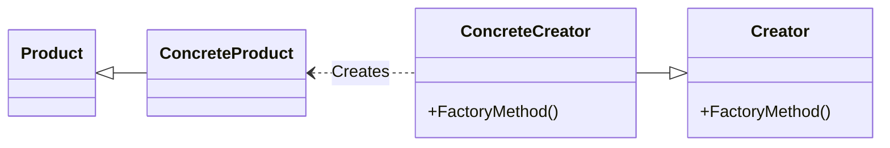
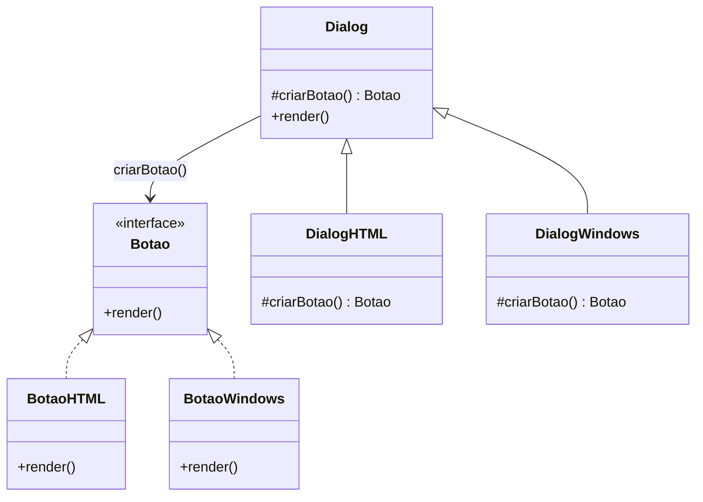
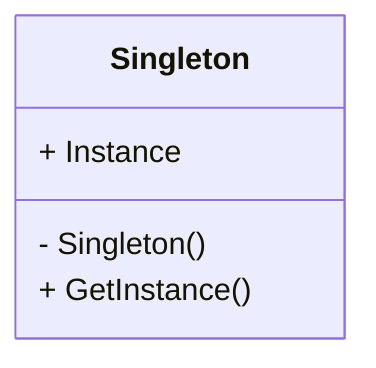
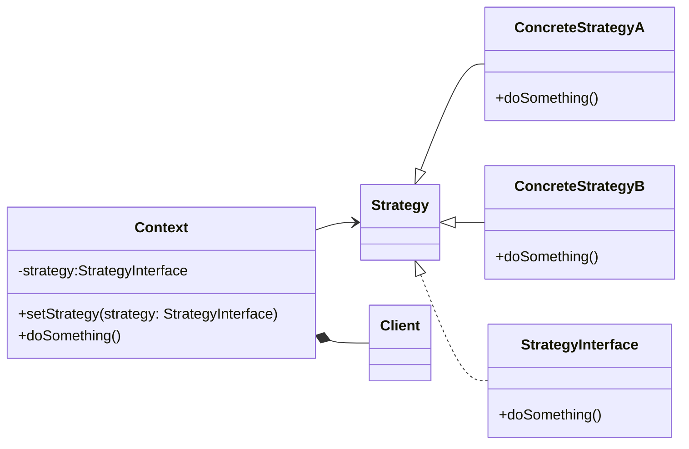
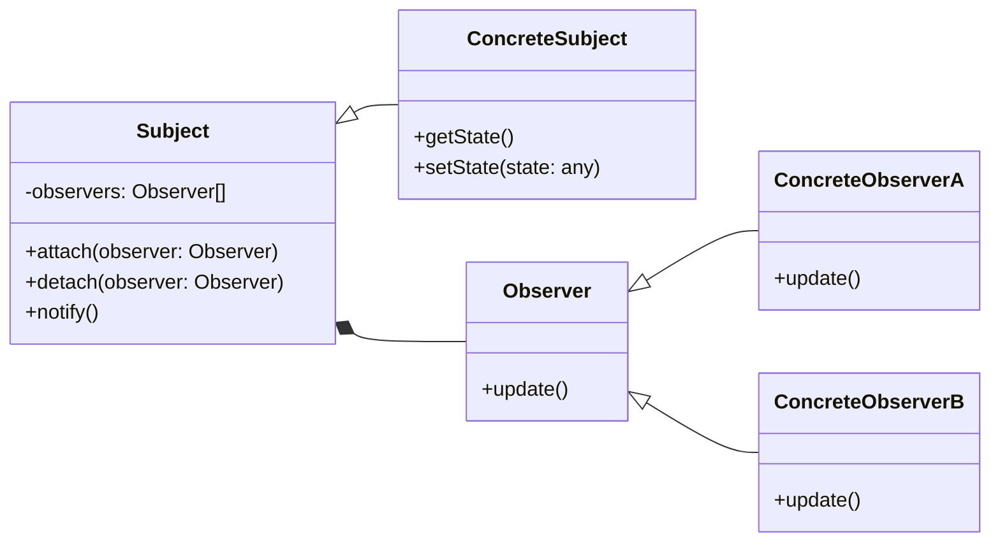

# Design Patterns

1. Introdução  
2. Factory Method  
3. Singleton  
4. Strategy  
5. Observer  
6. Comparações, armadilhas e boas práticas  
7. Exercício guiado  
8. Leituras e referências  

---

## 1 | INTRODUÇÃO

### 1.1 Por que estudar padrões?
- **Vocabulário comum** entre desenvolvedores.  
- **Reuso de soluções testadas** em vez de reinventar.  
- **Documentação viva**: um diagrama + o nome do padrão já transmitem a ideia.  

### 1.2 Padrões “Gang of Four”  
O livro **“Design Patterns: Elements of Reusable OO Software”** (Gamma et al., 1994) cataloga 23 padrões, divididos em **criacionais**, **estruturais** e **comportamentais**. Aqui cobriremos:

| Padrão | Categoria | Problema‑raiz resolvido |
|--------|-----------|-------------------------|
| Factory Method | Criacional | Instanciar objetos sem acoplar cliente à classe concreta. |
| Singleton | Criacional | Garantir única instância global, acessível de forma controlada. |
| Strategy | Comportamental | Encapsular algoritmos intercambiáveis. |
| Observer | Comportamental | Notificar múltiplos interessados quando o estado muda. |

---

## 2 | FACTORY METHOD

### 2.1 Motivação
- **Sintoma**: código cliente faz `new ClasseConcreta()` em vários lugares.  
- **Problema**: difícil trocar a classe concreta, testar ou extender.  
- **Solução**: mover a lógica de criação para uma **subclasse fábrica**.

### 2.2 Estrutura UML (simplificada)



### 2.3 Implementação Java

```java
// 1. Produto
interface Botao {
    void render();
}

// 2. Produtos concretos
class BotaoHTML implements Botao {
    public void render() { System.out.println("<button>HTML</button>"); }
}
class BotaoWindows implements Botao {
    public void render() { System.out.println("Botão Windows"); }
}

// 3. Creator
abstract class Dialog {
    // factory method
    protected abstract Botao criarBotao();
    public void render() {
        Botao b = criarBotao();
        b.render();
    }
}

// 4. Creators concretos
class DialogHTML extends Dialog {
    protected Botao criarBotao() { return new BotaoHTML(); }
}
class DialogWindows extends Dialog {
    protected Botao criarBotao() { return new BotaoWindows(); }
}

// 5. Uso
Dialog dlg = System.getProperty("os.name").startsWith("Win")
               ? new DialogWindows()
               : new DialogHTML();
dlg.render();
```



### 2.4 Variações
- **Abstract Factory**: cria *famílias* de produtos.  
- **Static Factory Method** (Java 8 `List.of(...)`).  
- **Factory via lambdas** (Supplier<T>).  

### 2.5 Boas práticas
- Mantenha **interface** de produto estável.  
- Não exagere: se só existe um produto, não precisa factory.

---

## 3 | SINGLETON

### 3.1 Motivação
- Alguns objetos devem existir **apenas uma vez** (configuração, cache, pool).  
- Precisa acesso global, mas sem variáveis globais caóticas.



### 3.2 Implementação segura (Java 5+)

```java
public enum Configuracao {
    INSTANCE;
    private Properties props;
    Configuracao() {
        props = new Properties();
        props.setProperty("app.name", "MeuApp");
    }
    public String get(String chave) { return props.getProperty(chave); }
}
```

*Por que enum?*  
- **Thread‑safe** na carga.  
- Impede **reflexão** de criar nova instância.  
- Simples serialização.

### 3.3 Pitfalls
- **Esconde dependência**: difícil testar.  
- **Estado global mutável** = risco de “spaghetti”.  
- Use DI (Container Spring) para injetar “um único” bean em vez de Singleton manual.

---

## 4 | STRATEGY

O padrão Strategy é um padrão de design comportamental que permite definir uma família de algoritmos, encapsular cada um como um objeto e torná-los intercambiáveis ​​em tempo de execução. O padrão Strategy permite que o algoritmo varie independentemente dos clientes que o utilizam.

No padrão Strategy, temos um contexto que contém uma referência a uma estratégia. O contexto pode definir uma interface comum a todas as estratégias suportadas. O contexto delega o trabalho à estratégia que implementa o algoritmo. Os clientes podem alterar a estratégia do contexto, o que altera o algoritmo executado pelo contexto.

### 4.1 Motivação
- Família de algoritmos que mudam em tempo de execução (ex.: ordenação, cálculo de frete).  
- Evitar `switch/case` ou herança explosiva.

### 4.2 Estrutura UML



### 4.3 Exemplo Java – Cálculo de Imposto

```java
// 1. Strategy
@FunctionalInterface
interface Imposto {
    double calcular(double valor);
}

// 2. Estratégias concretas
class ICMS implements Imposto {
    public double calcular(double v) { return v * 0.18; }
}
class ISS implements Imposto {
    public double calcular(double v) { return v * 0.05; }
}

// 3. Contexto
class Pedido {
    private double valor;
    public double total(Imposto imposto) {
        return valor + imposto.calcular(valor);
    }
}

// 4. Uso
Pedido p = new Pedido(1000);
System.out.println(p.total(new ICMS()));
System.out.println(p.total(v -> v * 0.12)); // lambda (Strategy on‑the‑fly)
```

### 4.4 Variações
- **Policy objects** em frameworks (Spring Security).  
- **Command pattern** é primo: encapsula *ação*, não *algoritmo*.

---

## 5 | OBSERVER

O padrão Observer é um padrão de design comportamental que permite que objetos assinem e recebam notificações de um ou mais publicadores (também conhecidos como sujeitos) quando há uma mudança em seu estado. Esse padrão ajuda a desacoplar o assinante e o publicador, permitindo que evoluam de forma independente, sem a necessidade de consultas constantes.

### 5.1 Motivação
- Precisa **notificar** vários objetos quando algo muda, sem acoplamento forte.  
- Ex.: GUI, eventos de domínio, pub‑sub.

### 5.2 Estrutura UML



### 5.3 Exemplo Java – Evento de estoque

```java
// Observer
interface ObservadorEstoque {
    void atualizar(int novoEstoque);
}

// Subject
class Produto {
    private int estoque = 0;
    private List<ObservadorEstoque> obs = new ArrayList<>();
    public void addObs(ObservadorEstoque o){ obs.add(o); }
    public void setEstoque(int novo){
        estoque = novo;
        obs.forEach(o -> o.atualizar(novo));
    }
}

// Observers concretos
class Painel implements ObservadorEstoque {
    public void atualizar(int e){ System.out.println("Painel: "+e); }
}
class EmailAlerta implements ObservadorEstoque {
    public void atualizar(int e){ /* envia email */ }
}

// Uso
Produto p = new Produto();
p.addObs(new Painel());
p.addObs(new EmailAlerta());
p.setEstoque(5);
```

### 5.4 Observer moderno
- Java util `java.beans.PropertyChangeSupport`.  
- Eventos Spring (ApplicationEventPublisher).  
- RxJava / Reactor → Flux, Observable (reactive streams).

---

## 6 | COMPARAÇÕES, ARMADILHAS E BOAS PRÁTICAS

| Padrão | Anti‑pattern se… | Dicas |
|--------|------------------|-------|
| Factory | só existe uma classe concreta | Use `new` direto. |
| Singleton | vira “variável global” mutável | Prefira DI / enum. |
| Strategy | muitas estratégias mas contexto nunca muda | Talvez simples método seja suficiente. |
| Observer | quantidade enorme de assinantes gera cascata | Use fila assíncrona, back‑pressure. |

---

## 7 | EXERCÍCIO GUIADO

### Cálculo de Frete com Strategy
*(Objetivo: aplicar o padrão **Strategy** em Java, permitindo trocar o algoritmo de cálculo de frete em tempo de execução; ao final, mostrar também como usar **lambdas** para criar estratégias “on‑the‑fly”.)*  

---

### Visão geral

Você construirá um pequeno módulo de e‑commerce que calcula o custo de frete de um **Pedido**.  
O sistema deve suportar **três estratégias oficiais**:

1. **PAC** – frete econômico (correios).  
2. **SEDEX** – frete expresso (correios).  
3. **Transportadora** – frete de terceiros, cujo preço varia por faixa de peso.

Além disso, o usuário poderá **injetar** uma estratégia nova em tempo de execução usando **expressões lambda** (Java 8+).

---

### Passo 1 – Definir o domínio mínimo

1. **Crie** o pacote base `br.com.frete` (ou outro namespace).  
2. **Classe Pedido**  
   - Atributos:  
     ```java
     private double pesoKg;
     private double valorMercadoria;
     private String cepDestino;
     ```  
   - Construtor que recebe `pesoKg` e `cepDestino` (ignore `valorMercadoria` por ora).  
   - Getters necessários.

```java
public class Pedido {
    private final double pesoKg;
    private final String cepDestino;
    public Pedido(double pesoKg, String cepDestino) {
        this.pesoKg = pesoKg;
        this.cepDestino = cepDestino;
    }
    public double getPesoKg() { return pesoKg; }
    public String getCepDestino() { return cepDestino; }
}
```

---

### Passo 2 – Declarar a **interface Strategy**

Crie `FreteStrategy` (ou apenas `Frete`) no pacote `br.com.frete.strategy`:

```java
@FunctionalInterface
public interface FreteStrategy {
    /**
     * @param pedido  Pedido com peso e CEP destino
     * @return        Valor do frete em reais
     */
    double calcular(Pedido pedido);
}
```

> **Observação:** marcamos com `@FunctionalInterface` para habilitar uso direto de **lambdas** mais tarde.

---

### Passo 3 – Implementar as três estratégias concretas

### 3.1 PAC

```java
public class FretePAC implements FreteStrategy {
    @Override
    public double calcular(Pedido p) {
        // regra fictícia: R$10 + R$2 por kg
        return 10.0 + 2.0 * p.getPesoKg();
    }
}
```

#### 3.2 SEDEX

```java
public class FreteSedex implements FreteStrategy {
    @Override
    public double calcular(Pedido p) {
        // regra fictícia: R$18 + R$3.5 por kg
        return 18.0 + 3.5 * p.getPesoKg();
    }
}
```

#### 3.3 Transportadora

```java
public class FreteTransportadora implements FreteStrategy {
    @Override
    public double calcular(Pedido p) {
        double peso = p.getPesoKg();
        if (peso <= 5)       return 25.0;
        else if (peso <= 20) return 30.0 + (peso - 5) * 1.8;
        else                 return 60.0 + (peso - 20) * 1.2;
    }
}
```

*(Regras meramente ilustrativas.)*

---

### Passo 4 – Criar o **Contexto** (`CalculadoraFrete`)

```java
public class CalculadoraFrete {
    private FreteStrategy estrategia;

    public CalculadoraFrete(FreteStrategy estrategia) {
        this.estrategia = estrategia;
    }
    /** Permite trocar estratégia em runtime */
    public void setEstrategia(FreteStrategy estrategia) {
        this.estrategia = estrategia;
    }
    public double calcular(Pedido pedido) {
        if (estrategia == null)
            throw new IllegalStateException("Estratégia de frete não definida!");
        return estrategia.calcular(pedido);
    }
}
```

---

### Passo 5 – Teste básico (Main)

```java
public class Main {
    public static void main(String[] args) {
        Pedido pedido = new Pedido(8.5, "01310-100");

        CalculadoraFrete calc = new CalculadoraFrete(new FretePAC());
        System.out.println("PAC: R$" + calc.calcular(pedido));

        calc.setEstrategia(new FreteSedex());
        System.out.println("SEDEX: R$" + calc.calcular(pedido));

        calc.setEstrategia(new FreteTransportadora());
        System.out.println("Transportadora: R$" + calc.calcular(pedido));
    }
}
```

Execute e confira os valores.

---

### Passo 6 – **Trocar estratégia via lambda**

Porque `FreteStrategy` é funcional, podemos criar implementações “ad‑hoc”:

```java
FreteStrategy fretePromo = p -> 5.0 + 1.0 * p.getPesoKg(); // promoção relâmpago
calc.setEstrategia(fretePromo);
System.out.println("Promo: R$" + calc.calcular(pedido));
```

Ou até ler parâmetros externos:

```java
double taxaFixa = 12.0;
double taxaPorKg = 2.8;
calc.setEstrategia(p -> taxaFixa + taxaPorKg * p.getPesoKg());
```

### Passo 7 – Estrutura de Diretórios do Projeto

Abaixo está um exemplo de como você pode organizar os **pacotes** e **arquivos** em um projeto Maven/Gradle simples (padrão *src/main/java*):

```
frete-strategy/
└── src/
    ├── main/
    │   └── java/
    │       └── br/
    │           └── com/
    │               └── frete/
    │                   ├── Main.java
    │                   ├── Pedido.java
    │                   ├── CalculadoraFrete.java          <-- contexto
    │                   │
    │                   └── strategy/                      <-- pacote das estratégias
    │                       ├── FreteStrategy.java         <-- interface funcional
    │                       ├── FretePAC.java
    │                       ├── FreteSedex.java
    │                       └── FreteTransportadora.java
    │
    └── test/
        └── java/
            └── br/
                └── com/
                    └── frete/
                        └── CalculadoraFreteTest.java      <-- (opcional) testes JUnit
```

**Observações**

* `br.com.frete` é o **pacote‑raiz**; tudo relacionado ao domínio de frete fica dentro dele.  
* O subpacote `strategy` contém **somente** as implementações do padrão Strategy (princípio de coesão).  
* `Main.java` é um executável rápido para demonstração/manual‑test; em projetos reais, ele pode estar em um módulo *demo* ou *cli*.  
* Se usar **Maven**, o `pom.xml` ficará na raiz (`frete-strategy/pom.xml`).  
* Se usar **Gradle**, arquivos `build.gradle` ou `build.gradle.kts` ficarão na raiz igualmente.

---

### Recapitulando o aprendizado

| Conceito | Onde aplicamos? |
|----------|-----------------|
| **Strategy** | Interface `FreteStrategy` + três implementações + `CalculadoraFrete` (Context). |
| **Troca em runtime** | `setEstrategia()` + lambdas. |
| **Baixo acoplamento** | `CalculadoraFrete` não sabe detalhes dos algoritmos. |
| **Extensão sem modificação** | Nova estratégia = nova classe ou lambda, sem mudar contexto (aderência ao OCP). |

Com esse exercício você consolidou o padrão **Strategy**, aprendeu a **injetar** algoritmos em tempo de execução e a usar **expressões lambda** para criar estratégias rápidas e testáveis.

---

## 8 | REFERÊNCIAS

- Gamma, Helm, Johnson, Vlissides – *Design Patterns* (GoF).  
- Joshua Bloch – *Effective Java* (Item 1: static factory; Item 3: singleton).  
- Eric Freeman – *Head First Design Patterns* (2ª ed.).  
- Robert C. Martin – *Agile Principles, Patterns, and Practices*.  
- Spring Framework Docs – *Application Events*, *Bean Scopes*.

---

### ENCERRAMENTO

Estes quatro padrões representam **ferramentas de bolso**:

* **Factory** → criação flexível.  
* **Singleton** → identidade única controlada.  
* **Strategy** → comportamento intercambiável.  
* **Observer** → desacoplamento evento‑reação.

Compreender **motivações**, **diagramas** e **implementações idiomáticas em Java** permite aplicar (ou descartar) cada padrão conscientemente, produzindo código **extensível**, **testável** e **manutenível**.