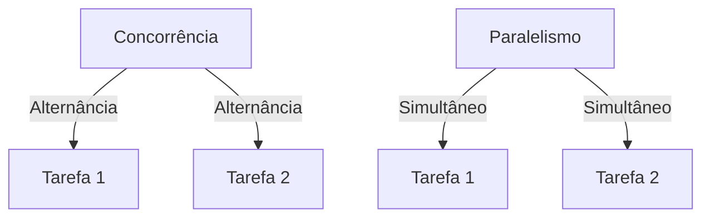
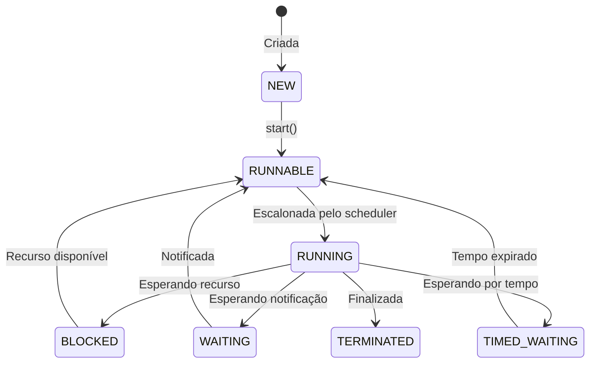
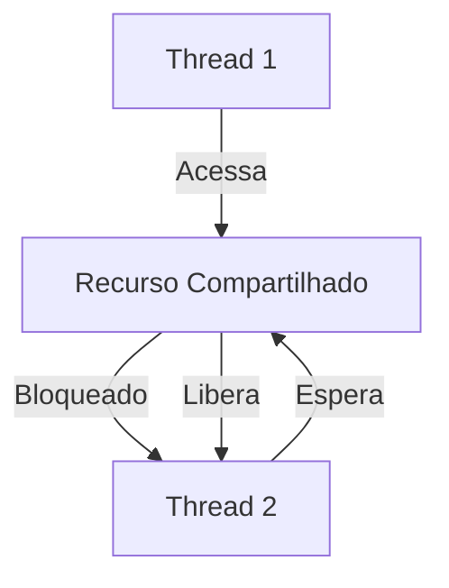
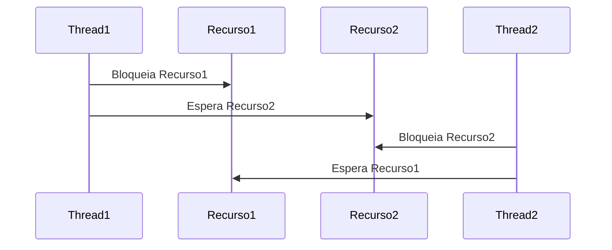
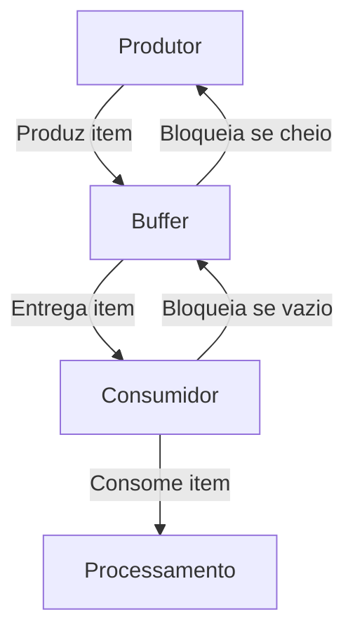

# Concorrência e Threads em Java

1. Introdução à Concorrência
    - O que é concorrência?
    - Concorrência vs. paralelismo
    - Processos vs. Threads
2. Criação de Threads em Java
    - Usando a classe Thread
    - Usando a interface Runnable
    - Diferença entre Thread e Runnable
3. Estados de uma Thread
    - Ciclo de vida
4. Sincronização em Java
    - Palavras-chave synchronized
    - Blocos sincronizados
    - Métodos sincronizados
    - Monitores
5. Problemas Clássicos de Concorrência
    - Race condition
    - Deadlock
    - Starvation
6. Soluções com API Avançada
    - API Executor e Thread Pools
    - Callable, Future, ScheduledExecutorService
    - Estruturas concorrentes (ConcurrentHashMap, CopyOnWriteArrayList)
    - Locks (ReentrantLock, ReadWriteLock)
7. Padrão Produtor-Consumidor
    - Problema clássico
    - Implementação com wait/notify
    - Soluções com BlockingQueue
8. Boas Práticas e Armadilhas
    - Evitar bloqueios desnecessários
    - Reduzir tempo de espera
    - Projetar para escalabilidade
    - Evitar sincronização excessiva
9. Estudos de Caso
    - Sistema de Log concorrente
    - Simulação de pool de conexões
10. Exercícios e Projeto Guiado
    - Exercícios práticos com correção
    - Implementação de solução concorrente controlada

---

### **1. Introdução à Concorrência**

#### 1.1 O que é Concorrência?
Concorrência é a capacidade de lidar com múltiplas tarefas que ocorrem dentro de um mesmo intervalo de tempo. Ela permite que um sistema lide com várias operações ao mesmo tempo (logicamente), mesmo que um processador execute uma tarefa de cada vez.


> **Exemplo Prático**: Um servidor web que processa múltiplas requisições de clientes simultaneamente.


Na prática, uma aplicação concorrente pode executar partes do código ao mesmo tempo por meio do uso de **threads**. Essas threads compartilham recursos, permitindo mais agilidade e resposta em aplicações que lidam com várias tarefas simultâneas, como servidores web, jogos e interfaces gráficas.

#### 1.2 Concorrência vs. Paralelismo
Embora muitos tratem os dois como sinônimos, há distinções fundamentais:

- **Concorrência** trata da estrutura do programa que lida com múltiplas tarefas, independentemente de serem executadas ao mesmo tempo.
- **Paralelismo** refere-se à execução física simultânea de várias tarefas, geralmente com uso de múltiplos núcleos ou processadores.

> **Exemplo:** Uma CPU com apenas um núcleo pode ser concorrente, alternando rapidamente entre tarefas. Uma CPU com múltiplos núcleos pode ser paralela, executando múltiplas tarefas ao mesmo tempo.


| **Aspecto**         | **Concorrência**                          | **Paralelismo**                          |
|----------------------|-------------------------------------------|-------------------------------------------|
| **Definição**        | Estrutura para lidar com múltiplas tarefas | Execução simultânea de múltiplas tarefas  |
| **Execução Física**  | Não necessariamente simultânea            | Sempre simultânea                         |
| **Exemplo**          | Alternância rápida entre tarefas          | Tarefas executadas em múltiplos núcleos   |



#### 1.3 Diferença entre Processos e Threads
| Característica         | Processo                                  | Thread                                     |
|------------------------|-------------------------------------------|--------------------------------------------|
| Espaço de memória      | Independente                              | Compartilhado com outras threads do processo |
| Tempo de criação       | Alto                                       | Baixo                                       |
| Custo de troca         | Alto                                       | Baixo                                       |
| Comunicação            | Mais difícil (IPC)                         | Mais fácil (memória compartilhada)          |
| Isolamento             | Total                                      | Parcial                                     |

Threads são preferidas quando se deseja leveza, comunicação mais eficiente e acesso a dados compartilhados.

> **Exemplo Real:**  Um navegador web pode usar processos para abas separadas e threads para carregar imagens em uma aba.

#### 1.4 Vantagens da Concorrência
- Aumento da performance percebida.
- Melhor uso dos recursos do sistema.
- Resposta mais rápida a eventos externos (UI, conexões de rede).
- Suporte a tarefas paralelas como I/O e processamento em segundo plano.

> **Exemplo Real:** Um navegador que carrega páginas em uma thread, renderiza imagens em outra e escuta eventos do usuário em uma terceira.

---

### **2. Criação de Threads em Java**

#### 2.1 Usando a classe Thread
A forma mais direta de criar uma thread em Java é estendendo a classe `Thread` e sobrescrevendo o método `run()`.

```java
class MinhaThread extends Thread {
    @Override
    public void run() {
        System.out.println("Executando thread: " + Thread.currentThread().getName());
    }
}

public class ExemploThread {
    public static void main(String[] args) {
        MinhaThread t1 = new MinhaThread();
        t1.start(); // Correto. Nunca use .run() diretamente
        // t1.run(); // Errado: executa no mesmo thread principal
    }
}
```

#### 2.2 Usando a interface Runnable
A alternativa mais recomendada é implementar a interface `Runnable`. Isso promove maior flexibilidade e evita herança desnecessária.

```java
class MinhaTarefa implements Runnable {
    @Override
    public void run() {
        System.out.println("Executando com Runnable: " + Thread.currentThread().getName());
    }
}

public class ExemploRunnable {
    public static void main(String[] args) {
        Thread t1 = new Thread(new MinhaTarefa());
        t1.start();
    }
}
```

#### 2.3 Usando Lambda (a partir do Java 8)
```java
public class ExemploLambda {
    public static void main(String[] args) {
        Thread t1 = new Thread(() -> {
            System.out.println("Thread via lambda executando: " + Thread.currentThread().getName());
        });
        t1.start();
    }
}
```

#### 2.4 Diferenças entre Thread e Runnable
| Aspecto                  | Thread                              | Runnable                             |
|--------------------------|--------------------------------------|--------------------------------------|
| Herança                 | Requer estender a classe Thread       | Permite herança de outra classe       |
| Flexibilidade            | Menor                                | Maior                                |
| Reusabilidade            | Limitada                             | Alta                                 |
| Boas práticas            | Menos recomendado                    | Mais usado no mercado                |

#### 2.5 Estados de uma Thread
O ciclo de vida de uma thread em Java pode ser representado com os seguintes estados:

1. **NEW** – Quando a thread é criada, mas ainda não foi iniciada.
2. **RUNNABLE** – Quando a thread está pronta para executar.
3. **RUNNING** – A thread está atualmente sendo executada.
4. **BLOCKED** – Aguardando acesso exclusivo a um recurso.
5. **WAITING / TIMED_WAITING** – Esperando que outra thread a notifique ou esperando por tempo.
6. **TERMINATED** – A thread completou sua execução.



```java
public class EstadosThread {
    public static void main(String[] args) throws InterruptedException {
        Thread t = new Thread(() -> {
            try {
                Thread.sleep(1000);
            } catch (InterruptedException e) {
                e.printStackTrace();
            }
        });

        System.out.println("Estado antes do start: " + t.getState()); // NEW
        t.start();
        Thread.sleep(100);
        System.out.println("Estado logo após start: " + t.getState()); // RUNNABLE or TIMED_WAITING
        Thread.sleep(1100);
        System.out.println("Estado após término: " + t.getState()); // TERMINATED
    }
}
```

---

### **3. Sincronização em Java**

#### 3.1 Por que sincronizar?
Quando múltiplas threads acessam os **mesmos recursos** (como uma variável ou estrutura de dados), há risco de **condições de corrida (race conditions)**. Para evitar que dados sejam lidos ou modificados de forma inconsistente, usamos mecanismos de **sincronização**.

#### 3.2 Palavra-chave `synchronized`
A palavra-chave `synchronized` impede que **mais de uma thread acesse simultaneamente** um bloco de código ou método.



##### 3.2.1 Sincronização em métodos
```java
public class Contador {
    private int valor = 0;

    public synchronized void incrementar() {
        valor++;
    }

    public synchronized int getValor() {
        return valor;
    }
}
```

##### 3.2.2 Sincronização em blocos
```java
public class Contador {
    private int valor = 0;

    public void incrementar() {
        synchronized (this) {
            valor++;
        }
    }
}
```

#### 3.3 Race Condition (Condição de Corrida)
Ocorre quando **duas ou mais threads acessam um recurso compartilhado** e tentam modificar seu estado ao mesmo tempo, produzindo resultados imprevisíveis.

```java
public class ExemploRaceCondition {
    private int contador = 0;

    public void incrementar() {
        contador++;
    }

    public static void main(String[] args) {
        ExemploRaceCondition exemplo = new ExemploRaceCondition();
        Thread t1 = new Thread(exemplo::incrementar);
        Thread t2 = new Thread(exemplo::incrementar);
        t1.start();
        t2.start();
    }
}
```

Solução com `synchronized`:

```java
public class ExemploSincronizado {
    private int contador = 0;

    public synchronized void incrementar() {
        contador++;
    }

    public static void main(String[] args) {
        ExemploSincronizado exemplo = new ExemploSincronizado();
        Thread t1 = new Thread(exemplo::incrementar);
        Thread t2 = new Thread(exemplo::incrementar);
        t1.start();
        t2.start();
    }
}
```

> **Exemplo Real:** Um banco que desconta saldo de duas transações concorrentes pode gerar saldo incorreto se as operações ocorrerem sem controle.


#### 3.4 Deadlock
Um **deadlock** acontece quando **duas ou mais threads ficam esperando indefinidamente por recursos que estão bloqueados entre si**.



```java
public class DeadlockExemplo {
    private static final Object recurso1 = new Object();
    private static final Object recurso2 = new Object();

    public static void main(String[] args) {
        Thread t1 = new Thread(() -> {
            synchronized (recurso1) {
                System.out.println("Thread 1: bloqueou recurso 1");
                try { Thread.sleep(50); } catch (InterruptedException e) {}
                synchronized (recurso2) {
                    System.out.println("Thread 1: bloqueou recurso 2");
                }
            }
        });

        Thread t2 = new Thread(() -> {
            synchronized (recurso2) {
                System.out.println("Thread 2: bloqueou recurso 2");
                try { Thread.sleep(50); } catch (InterruptedException e) {}
                synchronized (recurso1) {
                    System.out.println("Thread 2: bloqueou recurso 1");
                }
            }
        });

        t1.start();
        t2.start();
    }
}
```

#### 3.5 Starvation (Inanição)
Ocorre quando uma thread **fica esperando indefinidamente por CPU** ou acesso a um recurso, enquanto outras threads monopolizam os recursos do sistema.

#### 3.6 Boas práticas para sincronização
- Use o menor escopo possível para `synchronized`.
- Prefira `ConcurrentHashMap` em vez de `HashMap` sincronizado.
- Evite múltiplos locks aninhados.
- Considere `ReentrantLock` quando precisar de mais controle.

---

### **4. API Executor e Thread Pools**

#### 4.1 O problema de criar muitas threads
Criar uma nova thread com `new Thread(...).start()` toda vez **não escala bem** — pode esgotar recursos do sistema rapidamente.

#### 4.2 ExecutorService

```mermaid
flowchart TD
    A[ExecutorService] -->|submit()| B[Fila de Tarefas]
    B -->|Atribui tarefa| C[Thread 1]
    B -->|Atribui tarefa| D[Thread 2]
    B -->|Atribui tarefa| E[Thread N]
    C -->|Executa tarefa| F[Resultado 1]
    D -->|Executa tarefa| F[Resultado 2]
    E -->|Executa tarefa| F[Resultado N]
```

```java
import java.util.concurrent.ExecutorService;
import java.util.concurrent.Executors;

public class ExecutorExemplo {
    public static void main(String[] args) {
        ExecutorService executor = Executors.newFixedThreadPool(3);

        for (int i = 0; i < 10; i++) {
            final int tarefa = i;
            executor.submit(() -> {
                System.out.println("Executando tarefa " + tarefa);
            });
        }

        executor.shutdown();
    }
}
```

#### 4.3 Tipos de thread pools
- `newFixedThreadPool(int nThreads)`
- `newCachedThreadPool()`
- `newSingleThreadExecutor()`
- `newScheduledThreadPool(int corePoolSize)`

#### 4.4 Callable e Future
Permitem que threads **retornem valores**.
```java
Callable<Integer> tarefa = () -> 10 + 5;
Future<Integer> futuro = executor.submit(tarefa);
Integer resultado = futuro.get();
```

---

### **5. Estruturas Concorrentes e Locks Avançados**

#### 5.1 Estruturas concorrentes
- `ConcurrentHashMap`
- `CopyOnWriteArrayList`
- `BlockingQueue` e `LinkedBlockingQueue`

#### 5.2 ReentrantLock
Oferece mais controle que `synchronized`, como **tentativas temporizadas** de obter lock.
```java
Lock lock = new ReentrantLock();
lock.lock();
try {
    // região crítica
} finally {
    lock.unlock();
}
```

---

### **6. Padrão Produtor-Consumidor**

O padrão Produtor-Consumidor é um problema clássico de concorrência em que:
- Produtores geram dados e os colocam em um buffer.
- Consumidores retiram dados do buffer para processá-los.
- O desafio é garantir que:
  - O produtor não insira dados em um buffer cheio.
  - O consumidor não tente retirar dados de um buffer vazio.
  - A comunicação entre threads seja feita de forma segura e eficiente.





#### 6.1 Exemplo com `wait()` e `notify()`

Os métodos `wait()` e `notify()` são usados para coordenar a execução de threads que compartilham um recurso. Eles fazem parte da classe `Object` e só podem ser chamados dentro de blocos ou métodos sincronizados.
- `wait()`: Faz com que a thread atual espere até que outra thread chame `notify()` ou `notifyAll()` no mesmo objeto monitor.
- `notify()`: Acorda uma única thread que está esperando no objeto monitor.
- `notifyAll()`: Acorda todas as threads que estão esperando no objeto monitor.


Exemplo explicado:

```java
class Buffer {
    private int dado; // Armazena o dado produzido
    private boolean disponivel = false; // Indica se o dado está disponível

    // Método para o produtor inserir um valor no buffer
    public synchronized void produzir(int valor) throws InterruptedException {
        while (disponivel) { // Se o buffer já estiver cheio, espera
            wait();
        }
        dado = valor; // Produz o dado
        disponivel = true; // Marca o dado como disponível
        notifyAll(); // Notifica os consumidores que o dado está disponível
    }

    // Método para o consumidor retirar um valor do buffer
    public synchronized int consumir() throws InterruptedException {
        while (!disponivel) { // Se o buffer estiver vazio, espera
            wait();
        }
        disponivel = false; // Marca o dado como consumido
        notifyAll(); // Notifica os produtores que o buffer está vazio
        return dado; // Retorna o dado consumido
    }
}
```

Explicação do Fluxo:
- O produtor verifica se o buffer está cheio (`disponivel == true`). Se estiver, ele chama `wait()` e aguarda.
- Quando o consumidor consome o dado, ele chama `notifyAll()` para acordar o produtor.
- O consumidor verifica se o buffer está vazio (`disponivel == false`). Se estiver, ele chama `wait()` e aguarda.
- Quando o produtor insere um novo dado, ele chama `notifyAll()` para acordar o consumidor.


#### 6.2 Exemplo com `BlockingQueue`

A classe `BlockingQueue` (disponível no pacote `java.util.concurrent`) simplifica a implementação do padrão Produtor-Consumidor. Ela gerencia automaticamente a sincronização entre threads, eliminando a necessidade de usar `wait()` e `notify()` manualmente.

Principais Características:
- Bloqueio automático:
  - O método `put()` bloqueia o produtor se a fila estiver cheia.
  - O método `take(`) bloqueia o consumidor se a fila estiver vazia.
- Implementações comuns:
  - `LinkedBlockingQueue`: Baseada em uma lista encadeada.
  - `ArrayBlockingQueue`: Baseada em um array fixo.


```java
import java.util.concurrent.BlockingQueue;
import java.util.concurrent.LinkedBlockingQueue;

public class ProdutorConsumidor {
    public static void main(String[] args) {
        BlockingQueue<Integer> fila = new LinkedBlockingQueue<>(10); // Buffer com capacidade de 10 itens

        // Produtor
        Runnable produtor = () -> {
            try {
                for (int i = 0; i < 10; i++) {
                    fila.put(i); // Insere o item na fila (bloqueia se estiver cheia)
                    System.out.println("Produziu: " + i);
                }
            } catch (InterruptedException e) {
                Thread.currentThread().interrupt();
            }
        };

        // Consumidor
        Runnable consumidor = () -> {
            try {
                for (int i = 0; i < 10; i++) {
                    int valor = fila.take(); // Retira o item da fila (bloqueia se estiver vazia)
                    System.out.println("Consumiu: " + valor);
                }
            } catch (InterruptedException e) {
                Thread.currentThread().interrupt();
            }
        };

        // Inicia as threads
        new Thread(produtor).start();
        new Thread(consumidor).start();
    }
}
```

Explicação do Fluxo:
1. O produtor usa o método put() para inserir itens na fila. Se a fila estiver cheia, ele será bloqueado até que o consumidor retire algum item.
2. O consumidor usa o método take() para retirar itens da fila. Se a fila estiver vazia, ele será bloqueado até que o produtor insira algum item.
3. A sincronização é gerenciada automaticamente pela BlockingQueue, tornando o código mais simples e menos propenso a erros.


#### 6.3 Comparação `wait()` e `notify()` vs `BlockingQueue`

| Aspecto                  | `wait/notify`                          | `BlockingQueue`                          |
|--------------------------|-----------------------------------------|------------------------------------------|
| **Complexidade**         | Alta (requer sincronização manual)     | Baixa (sincronização automática)         |
| **Legibilidade**         | Menor (código mais verboso)            | Maior (código mais simples)              |
| **Controle de Buffer**   | Manual                                 | Automático                               |
| **Uso Recomendado**      | Casos específicos ou legado            | Implementações modernas                  |

---

### **7. Boas Práticas e Armadilhas em Concorrência**

- **Evite acesso direto a variáveis compartilhadas.**
- **Evite bloqueios desnecessários.**
- **Prefira abstrações de alto nível** (`ExecutorService`, `ConcurrentHashMap`, `BlockingQueue`).
- **Reduza o tempo dentro de regiões críticas.**
- **Sempre libere locks em blocos `finally`.**
- **Evite `Thread.sleep()` para sincronização.**
- **Use `volatile` apenas quando necessário.**
- **Documente código concorrente claramente.**

---

### **8. Conclusão**
Programação concorrente em Java é uma habilidade poderosa, porém complexa. Entender como **threads são criadas, sincronizadas, coordenadas e controladas** é essencial para construir **sistemas robustos, performáticos e escaláveis**. Utilizar as ferramentas modernas da linguagem — como `ExecutorService`, `Locks`, `Concurrent Collections` — permite maior clareza, segurança e manutenção.
