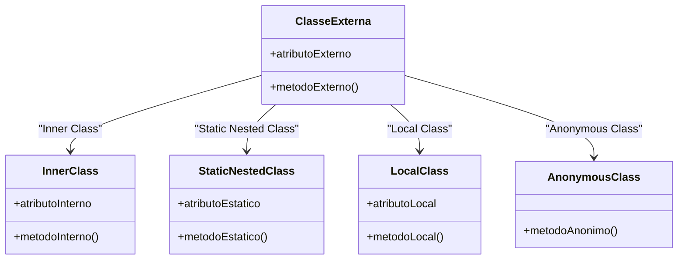
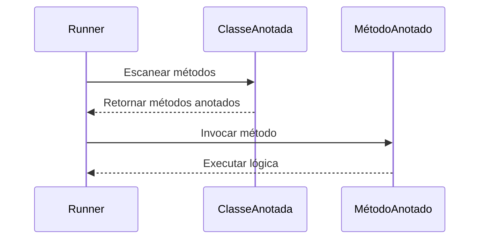

# Tópicos Avançados de Java

1. Introdução aos Tópicos Avançados
2. Classes Internas
   - Inner Classes (Membro)
   - Local Classes (Classe Interna Local)
   - Anonymous Classes (Classes Anônimas)
   - Comparação com Expressões Lambda
   - Casos de Uso Reais
3. Annotations (Anotações)
   - Conceito e Finalidade
   - Anotações Comuns do Java
   - Criando Anotações Personalizadas
   - Leitura de Anotações com Reflection
4. Reflection (Reflexão em Java)
   - O que é Reflection
   - API Reflection: Class, Field, Method
   - Casos de Uso Práticos
   - Riscos: Segurança, Performance e Quebra de Encapsulamento
5. Estudos de Caso
   - Mini Framework com Anotações
   - Injeção de Dependência Manual com Reflection
6. Exercícios Práticos
7. Referências

---

# 1. Introdução aos Tópicos Avançados

À medida que projetos Java crescem, surgem necessidades mais sofisticadas de modularidade, reutilização de comportamento, e adaptação dinâmica. Nesta aula, estudaremos **três recursos avançados da linguagem Java**:

- **Classes Internas**, para organização e encapsulamento lógico de código;
- **Anotações**, que embutem metadados nos elementos da linguagem;
- **Reflexão**, que fornece um meio de inspecionar e modificar a estrutura do programa em tempo de execução.

Esses conceitos estão na base de diversos frameworks modernos como Spring, Hibernate, Jackson, e ferramentas como JUnit e Jakarta EE.

A seguir, detalharemos o primeiro desses pilares: as classes internas.

---

# 2. Classes Internas

Classes internas são classes declaradas dentro de outras classes ou métodos. Elas oferecem uma forma poderosa de estruturar código que depende fortemente do contexto onde está inserido. O uso de classes internas permite acesso direto a membros da classe externa, tornando-as úteis para encapsular lógica auxiliar que não precisa ser visível fora do escopo onde é utilizada.

Existem quatro tipos principais de classes internas em Java:
- **Inner Class (classe membro não estática)**
- **Static Nested Class (classe membro estática)**
- **Local Class (classe interna local a um método)**
- **Anonymous Class (classe anônima)**

Vamos detalhar cada uma delas.



## 2.1 Inner Classes (Membro)

### Conceito
São classes declaradas diretamente dentro de outra classe (não em método) e **sem o modificador `static`**. Elas possuem acesso total aos membros da classe externa, inclusive atributos e métodos privados.

### Exemplo:
```java
public class Externa {
    private String mensagem = "Olá do mundo externo";

    public class Interna {
        public void imprimir() {
            System.out.println(mensagem);
        }
    }
}

Externa externa = new Externa();
Externa.Interna interna = externa.new Interna();
interna.imprimir();
```

### Aplicações:
- Quando uma classe precisa ser associada fortemente à instância da classe externa.
- Boas para representar **componentes que dependem de dados do contexto externo**.

## 2.2 Local Classes (Classe Interna Local)

### Conceito
São classes definidas dentro de métodos, blocos ou construtores. Elas só são visíveis dentro desse escopo e não podem ser `public`, `protected`, `private` ou `static`.

### Exemplo:
```java
public void executar() {
    class Mensagem {
        void mostrar() {
            System.out.println("Executando local class");
        }
    }
    Mensagem msg = new Mensagem();
    msg.mostrar();
}
```

### Características:
- Só existem durante a execução do método onde são definidas.
- Podem acessar variáveis locais **efetivamente finais** do método envolvente.

## 2.3 Anonymous Classes (Classes Anônimas)

### Conceito
São classes internas **sem nome**, definidas e instanciadas no mesmo ponto. Utilizadas geralmente para **instanciar interfaces ou classes abstratas** de forma rápida.

### Exemplo:
```java
Runnable r = new Runnable() {
    @Override
    public void run() {
        System.out.println("Executando em thread anônima");
    }
};
r.run();
```

### Vantagens:
- Evitam a necessidade de criar uma classe nomeada para pequenas tarefas.
- Combinam bem com programação orientada a eventos.

### Desvantagens:
- Podem dificultar leitura se usadas excessivamente.
- Não são reutilizáveis.

## 2.4 Comparação com Expressões Lambda

Desde o Java 8, as **expressões lambda** substituem com elegância muitas aplicações de classes anônimas. Contudo, **lambdas só funcionam com interfaces funcionais** (interfaces com um único método abstrato).

### Exemplo com classe anônima:
```java
ActionListener listener = new ActionListener() {
    @Override
    public void actionPerformed(ActionEvent e) {
        System.out.println("Ação executada");
    }
};
```

### Mesmo código com lambda:
```java
ActionListener listener = e -> System.out.println("Ação executada");
```

### Quando usar classe anônima e não lambda?
- Quando há necessidade de múltiplos métodos ou campos auxiliares.
- Quando você quer instanciar uma classe **não funcional**.

## 2.5 Casos de Uso Reais
- **GUI event handlers** (JavaFX, Swing)
- **Testes de callbacks personalizados**
- **Iteradores personalizados com lógica única**
- **Implementações rápidas de interfaces com 1 ou 2 métodos**

Na próxima seção, exploraremos outro recurso poderoso: anotações, que fornecem metadados diretamente no código Java.

---

# 3. Annotations (Anotações)

## 3.1 Conceito e Finalidade

Anotações (ou annotations) são metadados aplicados ao código-fonte, que permitem ao compilador, bibliotecas ou frameworks interpretarem informações adicionais sobre classes, métodos, atributos, parâmetros ou outros elementos. Elas **não alteram diretamente o comportamento do código**, mas permitem que outras ferramentas o façam.

Anotações foram introduzidas no Java 5 com o objetivo de:
- Automatizar tarefas repetitivas.
- Eliminar arquivos de configuração XML.
- Aumentar a clareza do código.
- Facilitar integração com frameworks.

### Sintaxe Básica
```java
@Override
public String toString() {
    return "Exemplo";
}
```

## 3.2 Anotações Comuns do Java

### @Override
Garante que o método está realmente sobrescrevendo um método da superclasse.

### @Deprecated
Indica que o elemento está obsoleto e deve ser evitado.
```java
@Deprecated
public void antigoMetodo() {
    // ...
}
```

### @SuppressWarnings
Suprime avisos específicos do compilador.
```java
@SuppressWarnings("unchecked")
List lista = new ArrayList();
```

### @FunctionalInterface
Garante que a interface possui **apenas um método abstrato**.
```java
@FunctionalInterface
interface Operacao {
    int executar(int a, int b);
}
```

### @SafeVarargs
Evita warnings ao usar varargs com generics.

### @Retention, @Target, @Documented, @Inherited
Essas são **meta-anotações**, ou seja, anotam outras anotações e determinam seu comportamento:
- `@Retention`: define em que momento a anotação está disponível (fonte, bytecode, tempo de execução).
- `@Target`: onde a anotação pode ser usada (classe, método, campo, etc).
- `@Documented`: indica que a anotação deve aparecer no Javadoc.
- `@Inherited`: permite que a anotação seja herdada por subclasses.

## 3.3 Criando Anotações Personalizadas

### Exemplo:
```java
@Retention(RetentionPolicy.RUNTIME)
@Target(ElementType.METHOD)
public @interface Logavel {
    String nivel() default "INFO";
}
```

Uso:
```java
public class Servico {
    @Logavel(nivel = "DEBUG")
    public void executar() {
        System.out.println("Executando serviço...");
    }
}
```

### Observações:
- As anotações podem ter parâmetros com valores padrão.
- São muito utilizadas em frameworks como Spring, Jakarta EE, Hibernate.

## 3.4 Leitura de Anotações com Reflection
Para ler anotações em tempo de execução, usamos a API de reflection:

```java
Method metodo = Servico.class.getMethod("executar");
if (metodo.isAnnotationPresent(Logavel.class)) {
    Logavel log = metodo.getAnnotation(Logavel.class);
    System.out.println("Nível de log: " + log.nivel());
}
```

---
# 4. Reflection (Reflexão em Java)

## 4.1 O que é Reflection?

Reflection é a capacidade que uma linguagem de programação oferece para **inspecionar, analisar e modificar sua estrutura e comportamento em tempo de execução**. Em Java, essa funcionalidade é disponibilizada pelo pacote `java.lang.reflect` e pelas classes do pacote `java.lang`, como `Class`, `Method`, `Field` e `Constructor`.

Com reflection, é possível:

* Descobrir os métodos e campos de uma classe desconhecida;
* Invocar métodos e alterar campos, inclusive privados;
* Criar instâncias dinamicamente;
* Analisar anotações e modificadores;
* Fazer interações dinâmicas entre componentes desacoplados.

Reflection é uma das ferramentas mais poderosas do ecossistema Java, mas também uma das mais perigosas quando usada de forma indiscriminada.

---

## 4.2 API de Reflection: Class, Field, Method

A base de toda operação de reflection em Java é a classe `Class`. A partir de uma instância dela, podemos acessar os demais componentes:

```mermaid
flowchart TD
    A[Início] --> B[Obter Class: Class.forName()]
    B --> C[getDeclaredMethods()]
    B --> D[getDeclaredFields()]
    C --> E[Method.invoke()]
    D --> F[Field.setAccessible(true)]
    F --> G[Field.set() / get()]
    G --> H[Fim]
```

### Exemplo: inspecionando uma classe

```java
Class<?> clazz = Class.forName("java.util.ArrayList");
System.out.println("Classe: " + clazz.getName());
```

### Listando métodos de uma classe:

```java
for (Method method : clazz.getDeclaredMethods()) {
    System.out.println("Método: " + method.getName());
}
```

### Acessando e modificando campos privados:

```java
Field field = MinhaClasse.class.getDeclaredField("valorInterno");
field.setAccessible(true);
field.set(objeto, 42);
```

### Invocando métodos dinamicamente:

```java
Method metodo = MinhaClasse.class.getDeclaredMethod("executar");
metodo.invoke(instancia);
```

---

## 4.3 Casos de Uso Práticos

Reflection é amplamente utilizado em muitas ferramentas, bibliotecas e frameworks. Alguns exemplos clássicos incluem:

### **1. Injeção de Dependência**

Frameworks como Spring usam reflection para **instanciar classes e injetar dependências** automaticamente com base em anotações ou arquivos de configuração.

```java
@Autowired
private Repositorio repositorio;
```

Durante a execução, o Spring acessa esse campo com reflection e insere a instância correta sem que o desenvolvedor precise fazer isso manualmente.

### **2. Serialização e Desserialização**

Ferramentas como Gson e Jackson utilizam reflection para **converter objetos Java em JSON** (e vice-versa), analisando os campos e acessando seus valores em tempo de execução.

### **3. Testes Automatizados**

Frameworks de teste, como JUnit, usam reflection para **detectar métodos anotados com `@Test`**, criando instâncias e invocando esses métodos automaticamente.

Além disso, reflection é usado para acessar métodos e campos privados durante testes, garantindo maior cobertura de código mesmo em APIs encapsuladas.

### **4. ORM (Object-Relational Mapping)**

ORMs como Hibernate utilizam reflection para mapear classes Java em tabelas do banco de dados, acessando dinamicamente os campos das entidades e gerenciando persistência.

---

## 4.4 Reflection e Análise de Código: AST e Teste de Mutação

Uma aplicação menos conhecida, mas extremamente poderosa de reflection, é na **análise e transformação de código**, especialmente em ferramentas que trabalham com *Abstract Syntax Tree* (AST) e *mutação de testes*.

### **O que é AST?**

AST (Árvore de Sintaxe Abstrata) é uma representação hierárquica do código-fonte que preserva sua estrutura sintática e semântica. Ela é amplamente utilizada em compiladores, analisadores estáticos, linters e ferramentas de instrumentação de código.

Embora a API de Reflection em Java opere sobre o bytecode em tempo de execução, muitas ferramentas de análise de código e geração de código dinâmico se apoiam em ASTs geradas em tempo de compilação ou por bibliotecas como `javaparser`, `asm` ou `javassist`.

Combinando reflection e AST, é possível:

* Analisar comportamento e estrutura de métodos;
* Instrumentar código para rastrear chamadas;
* Automatizar a criação de wrappers e proxies;
* Gerar mocks ou espiões em testes com comportamento customizado.

---

### **Exemplo Prático: Teste de Mutação com Pitest**

**Teste de mutação** é uma técnica avançada de teste de software que avalia a qualidade dos testes existentes ao modificar (mutar) o código-fonte e verificar se os testes são capazes de detectar o erro introduzido. Se o teste falhar, o mutante é "morto". Se passar, o mutante "sobrevive", indicando um potencial ponto fraco nos testes.

Uma ferramenta popular para isso é o **[Pitest (PIT Mutation Testing)](https://pitest.org/)**, que combina análise de bytecode, AST e reflection para mutar código e executar testes automaticamente.

#### Exemplo de código:

```java
public class Calculadora {
    public int somar(int a, int b) {
        return a + b;
    }
}
```

#### Teste JUnit:

```java
@Test
void testSomar() {
    Calculadora c = new Calculadora();
    assertEquals(5, c.somar(2, 3));
}
```

#### Como o Pitest muta isso:

Pitest pode modificar automaticamente a linha `return a + b` para `return a - b`, ou `return a * b`, gerando **mutantes** do código.

Durante os testes, ele usará reflection para carregar dinamicamente o bytecode mutado da classe `Calculadora`, executar os testes e verificar se falham.

Se o teste passar mesmo com a mutação, Pitest aponta que o teste **não cobre corretamente** esse comportamento.

#### Exemplo de saída:

```
> Killed: 3, Survived: 1
> Mutation survived:
   - Replaced + with -
   - Method: Calculadora.somar
```

Isso revela que o teste foi incapaz de detectar o comportamento incorreto introduzido — algo que só é possível com uma combinação de reflection e manipulação de bytecode.

---

## 4.5 Vantagens e Poder de Reflection

Reflection amplia significativamente as possibilidades de desenvolvimento dinâmico e metaprogramação:

* Permite desenvolver frameworks genéricos e reutilizáveis.
* Facilita o desenvolvimento de ferramentas de teste, profiling e monitoração.
* Viabiliza soluções de código aberto e extensibilidade (ex: plugins).
* Habilita introspecção profunda e adaptação dinâmica.

Além disso, reflection é essencial para ferramentas que precisam interagir com código que não pode ser modificado, como bibliotecas externas ou binários fechados.

---

## 4.6 Riscos: Segurança, Performance e Quebra de Encapsulamento

Apesar de sua versatilidade, reflection **deve ser usada com extrema cautela**:

### **Quebra de encapsulamento**

Permitir acesso a campos e métodos privados rompe o contrato de encapsulamento da orientação a objetos. Isso pode levar a bugs difíceis de detectar e comprometer a manutenção futura.

### **Desempenho inferior**

Operações de reflection são mais lentas, pois envolvem introspecção, verificação de permissões e chamadas indiretas. Em caminhos críticos de performance (como algoritmos ou loops intensivos), deve-se evitar reflection.

### **Riscos de segurança**

Reflection pode ser usado para explorar vulnerabilidades e acessar partes sensíveis do sistema (como manipulação de campos privados, bypass de validações ou modificação de classes). Por isso, ambientes como applets, containers web e JVMs embarcadas frequentemente restringem reflection por meio de políticas de segurança (`SecurityManager`).

---

## 4.7 Boas Práticas

* **Evite reflection em código de produção crítico**. Use em ferramentas, testes ou extensões de propósito geral.
* **Nunca exponha reflection a entradas externas** (ex: nomes de classes/métodos vindos de usuários) sem validação rigorosa.
* **Prefira APIs declarativas quando possível** (como `ServiceLoader`, anotações ou interfaces).
* **Documente claramente quando reflection for necessário**, para facilitar manutenção.
* **Combine com bibliotecas seguras** como Spring, Jackson, Mockito, que encapsulam os detalhes de reflection.

---

## 4.8 Conclusão - Reflection

Reflection é um **instrumento poderoso** no arsenal do desenvolvedor Java, capaz de transformar profundamente como aplicações são estruturadas, testadas e estendidas. Ao permitir a introspecção e a manipulação dinâmica do código em tempo de execução, abre portas para soluções avançadas como frameworks de injeção de dependência, serialização personalizada, testes automatizados robustos e análise de código dinâmico.

Por outro lado, seu uso impõe responsabilidades: é preciso compreender seus riscos, evitar abusos e usá-la com discernimento técnico. Quando bem aplicada, reflection pode ser a chave para escrever sistemas altamente adaptáveis, introspectivos e inteligentes.


---

# 5. Estudos de Caso

Nesta seção, aplicaremos os conceitos de anotações e reflexão através de cenários práticos para demonstrar seu uso em contextos que simulam o comportamento de frameworks reais. As implementações são simplificadas, porém representam a base de como muitas bibliotecas do ecossistema Java operam internamente.

## 5.1 Mini Framework com Anotações

### Cenário
Desejamos implementar uma solução genérica para log de métodos, sem alterar a lógica interna das classes. Utilizaremos anotações personalizadas e reflexão para identificar métodos que devem ser "interceptados" e registrados no log.



### Etapa 1: Criar a anotação
```java
@Retention(RetentionPolicy.RUNTIME)
@Target(ElementType.METHOD)
public @interface Loggable {
    String value() default "INFO";
}
```

### Etapa 2: Criar uma classe de serviço
```java
public class Operacoes {
    @Loggable("DEBUG")
    public void salvar() {
        System.out.println("Salvando...");
    }

    @Loggable("INFO")
    public void atualizar() {
        System.out.println("Atualizando...");
    }

    public void listar() {
        System.out.println("Listando...");
    }
}
```

### Etapa 3: Criar um executor genérico
```java
public class LogRunner {
    public static void executarLog(Object obj) throws Exception {
        for (Method metodo : obj.getClass().getDeclaredMethods()) {
            if (metodo.isAnnotationPresent(Loggable.class)) {
                Loggable anotacao = metodo.getAnnotation(Loggable.class);
                System.out.println("[" + anotacao.value() + "] Chamando método: " + metodo.getName());
                metodo.invoke(obj);
            }
        }
    }
}
```


### Execução:
```java
Operacoes op = new Operacoes();
LogRunner.executarLog(op);
```

### Resultados esperados:
```
[DEBUG] Chamando método: salvar
Salvando...
[INFO] Chamando método: atualizar
Atualizando...
```

## 5.2 Injeção de Dependência Manual com Reflection

### Cenário
Desejamos simular uma **injeção de dependência** onde um objeto de uma classe é "injetado" dentro de outra, sem usar construtores ou setters explicitamente. Essa técnica é útil para criar estruturas desacopladas e preparar objetos dinamicamente em tempo de execução.

### Etapa 1: Criação das classes
```java
public class Repositorio {
    public void conectar() {
        System.out.println("Conectando ao banco de dados...");
    }
}

public class Servico {
    private Repositorio repo;

    public void executar() {
        repo.conectar();
        System.out.println("Serviço em execução.");
    }
}
```

### Etapa 2: Injeção via reflexão
```java
Repositorio repositorio = new Repositorio();
Servico servico = new Servico();

Field campo = Servico.class.getDeclaredField("repo");
campo.setAccessible(true);
campo.set(servico, repositorio);

servico.executar();
```

### Saída esperada:
```
Conectando ao banco de dados...
Serviço em execução.
```

### Explicação
- Esse mecanismo é semelhante ao que o Spring faz com `@Autowired`, porém aqui é implementado "na mão" com `Field.set()`.
- `setAccessible(true)` quebra o encapsulamento, permitindo modificar membros privados.

## Considerações finais
Esses estudos de caso demonstram como o Java pode ser flexível e poderoso através de recursos de metaprogramação. Embora essas abordagens devam ser usadas com cautela, elas são extremamente úteis para construir frameworks, mecanismos de automação, serialização dinâmica, entre outros.

# 6. Exercícios Práticos

A seguir, uma série de exercícios cuidadosamente elaborados para aplicar os conceitos estudados sobre classes internas, anotações e reflection. Cada exercício traz um contexto prático, objetivo claro e sugestões de como testar ou estender a solução.

### Exercício 1 – Classe Interna: `Carro` e `Motor`
**Objetivo:** Compreender como uma classe interna (non-static) pode acessar atributos da classe externa.

**Descrição:**
Crie a classe `Carro` com os atributos `modelo` e `potencia`. Dentro da classe, declare uma inner class `Motor` que tenha um método `ligar()` e imprima:

> "O motor do [modelo] está funcionando com [potencia] cavalos."

**Dica:** Use o `this` externo com `Carro.this.modelo` se quiser tornar o escopo explícito.

### Exercício 2 – Anotação Personalizada: `@Auditar`
**Objetivo:** Aprender a criar e utilizar uma anotação customizada com `RetentionPolicy.RUNTIME`.

**Descrição:**
- Crie a anotação `@Auditar` com parâmetro `String acao()`.
- Crie a classe `Pagamento` com métodos como `processar()`, `cancelar()`, etc.
- Anote alguns métodos com `@Auditar(acao="cancelamento")`.
- Com uso de reflection, escreva um analisador que imprime:

> "Método [nome] requer auditoria para: [ação]"

### Exercício 3 – Análise Reflexiva de Objetos
**Objetivo:** Refletir sobre a estrutura de qualquer objeto em tempo de execução.

**Descrição:**
Implemente um método `inspecionarObjeto(Object obj)` que use reflection para:
- Listar todos os atributos (campos) do objeto.
- Tornar os campos acessíveis se forem privados.
- Imprimir nome, tipo e valor atual de cada campo.

**Desafio extra:** Recursivamente inspecionar os atributos se eles forem objetos próprios.

### Exercício 4 – Refatoração de Classe Anônima para Lambda
**Objetivo:** Comparar classe anônima com expressão lambda em termos de clareza e concisão.

**Descrição:**
Dado este código:
```java
ActionListener a = new ActionListener() {
    public void actionPerformed(ActionEvent e) {
        System.out.println("Botão clicado");
    }
};
```
- Reescreva-o usando uma lambda.
- Comente as diferenças e vantagens percebidas.

### Exercício 5 – Framework Simples com Anotação
**Objetivo:** Simular um mini-framework que escaneia anotações e executa métodos automaticamente.

**Descrição:**
- Crie a anotação `@ExecutarAoIniciar`.
- Crie uma classe `Inicializador` com métodos diversos anotados com `@ExecutarAoIniciar`.
- Implemente uma classe `Runner` que, ao ser executada, localiza todos os métodos anotados e os executa.

**Dica:** Use `Method.isAnnotationPresent()` e `invoke()` com reflexão.

# 7. Referências

- Oracle Java Platform Annotations: https://docs.oracle.com/javase/tutorial/java/annotations/
- Reflection API Guide: https://docs.oracle.com/javase/tutorial/reflect/
- Baeldung: https://www.baeldung.com/java-reflection

---

