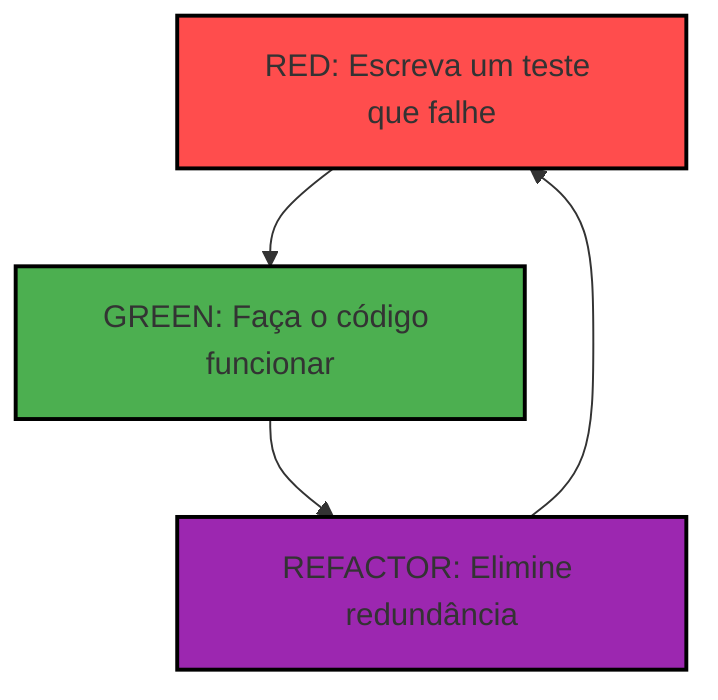

# Testes Práticos, Boas Práticas e Introdução ao Desenvolvimento Orientado a Testes (TDD)

## Sumário

1. Testes Práticos e Boas Práticas
   - Escrita de testes claros e descritivos
   - Organização dos testes
   - Manutenção e evolução dos testes
   - Exemplos práticos
2. Introdução ao Desenvolvimento Orientado a Testes (TDD)
   - Conceito e filosofia do TDD
   - Ciclo Red-Green-Refactor
   - Benefícios do TDD
   - Desafios e dicas para adoção
3. Recursos
4. Avaliação

---

## 1. Testes Práticos e Boas Práticas

### Escrita de testes claros e descritivos

A clareza na escrita de testes é essencial para garantir que outros desenvolvedores possam entender rapidamente o propósito de cada teste. Boas práticas incluem:

- **Nomes de métodos descritivos:** Um bom nome de teste deve indicar claramente o comportamento esperado. Por exemplo, `deveRetornarErroQuandoValorInvalido()` é muito mais informativo do que `testeErroValor`.
- **Testes independentes:** Cada teste deve ser isolado, sem dependências de outros testes ou do estado global da aplicação.

#### Exemplo:

```java
@Test
void deveRetornarErroQuandoValorInvalido() {
    PagamentoService pagamentoService = new PagamentoService(dummyServicoExterno());
    IllegalArgumentException exception = assertThrows(IllegalArgumentException.class, () -> {
        pagamentoService.processarPagamento(0.0);
    });
    assertEquals("Valor inválido", exception.getMessage());
}

private ServicoExterno dummyServicoExterno() {
    return valor -> { throw new UnsupportedOperationException("Não deve ser chamado"); };
}
```

### Organização dos testes

A organização dos testes é fundamental para facilitar a manutenção e evolução do código. Algumas práticas recomendadas incluem:

- **Estruturação por funcionalidade:** Agrupe os testes em classes que correspondam às funcionalidades ou classes testadas.
- **Uso de anotações do JUnit:** Utilize `@BeforeEach` para configurar o ambiente antes de cada teste e `@AfterEach` para limpar recursos após cada teste.

#### Exemplo:

```java
@BeforeEach
void setup() {
    // Configuração inicial antes de cada teste
}

@AfterEach
void tearDown() {
    // Limpeza após cada teste
}
```

### Manutenção e evolução dos testes

Testes devem ser tratados como código de produção, ou seja, devem ser refatorados e mantidos com o mesmo cuidado. Boas práticas incluem:

- **Evitar duplicação:** Refatore testes para reutilizar código comum.
- **Evitar testes frágeis:** Testes que dependem de detalhes internos do código são mais propensos a falhar com mudanças.

#### Exemplo:

```java
@Test
void deveRetornarErroQuandoValorInvalido() {
    PagamentoService pagamentoService = new PagamentoService(dummyServicoExterno());
    IllegalArgumentException exception = assertThrows(IllegalArgumentException.class, () -> {
        pagamentoService.processarPagamento(0.0);
    });
    assertEquals("Valor inválido", exception.getMessage());
}

private ServicoExterno dummyServicoExterno() {
    return valor -> { throw new UnsupportedOperationException("Não deve ser chamado"); };
}
```

---

## 2. Introdução ao Desenvolvimento Orientado a Testes (TDD)

### Conceito e filosofia do TDD

O TDD (Test-Driven Development) é uma abordagem de desenvolvimento onde os testes são escritos antes do código de produção. Isso garante que o código atenda aos requisitos desde o início e promove um design mais simples e modular.

#### Filosofia:

- Escreva primeiro o teste que define o comportamento esperado.
- Depois, implemente o código para passar nesse teste.
- Refatore o código mantendo todos os testes verdes.

### Ciclo Red-Green-Refactor

O ciclo do TDD é composto por três etapas:

1. **Red:** Escreva um teste que falha, indicando que o comportamento esperado ainda não foi implementado.
2. **Green:** Implemente o código mínimo necessário para passar no teste.
3. **Refactor:** Melhore o código sem alterar o comportamento, mantendo os testes passando.




#### Exemplo:

```java
// Red: Escrevendo um teste que falha
@Test
void deveValidarValorPositivo() {
    PagamentoService pagamentoService = new PagamentoService(dummyServicoExterno());
    assertThrows(IllegalArgumentException.class, () -> {
        pagamentoService.processarPagamento(-10.0);
    });
}

// Green: Implemente o código mínimo necessário para passar no teste
public void processarPagamento(double valor) {
    if (valor <= 0) {
        throw new IllegalArgumentException("Valor inválido");
    }
    // lógica de pagamento
}

// Refactor: Melhore o código sem alterar o comportamento
public void processarPagamento(double valor) {
    validarValor(valor);
    // lógica de pagamento
}

private void validarValor(double valor) {
    if (valor <= 0) {
        throw new IllegalArgumentException("Valor inválido");
    }
}
```

### Benefícios do TDD

- Código mais confiável e com menos bugs.
- Design mais simples e modular.
- Documentação viva através dos testes.

### Desafios e dicas para adoção

- Curva de aprendizado e disciplina necessárias.
- Comece com pequenos ciclos e aumente a complexidade gradativamente.
- Use testes como guia para o design do código.

---

## Conclusão

O Desenvolvimento Orientado a Testes (TDD) é uma prática poderosa que não apenas melhora a qualidade do código, mas também promove um design mais simples e modular. Ao adotar o ciclo Red-Green-Refactor, os desenvolvedores podem garantir que o código atenda aos requisitos desde o início, reduzindo bugs e facilitando a manutenção.

Embora o TDD exija disciplina e uma curva de aprendizado inicial, seus benefícios são evidentes em projetos de longo prazo. Testes bem escritos servem como documentação viva, ajudando equipes a entenderem o comportamento do sistema e a evoluírem o código com confiança.

Portanto, ao aplicar as boas práticas discutidas nesta aula e integrar o TDD ao seu fluxo de trabalho, você estará investindo na qualidade e sustentabilidade do seu software. Lembre-se: o esforço inicial compensa com um código mais robusto e confiável.
